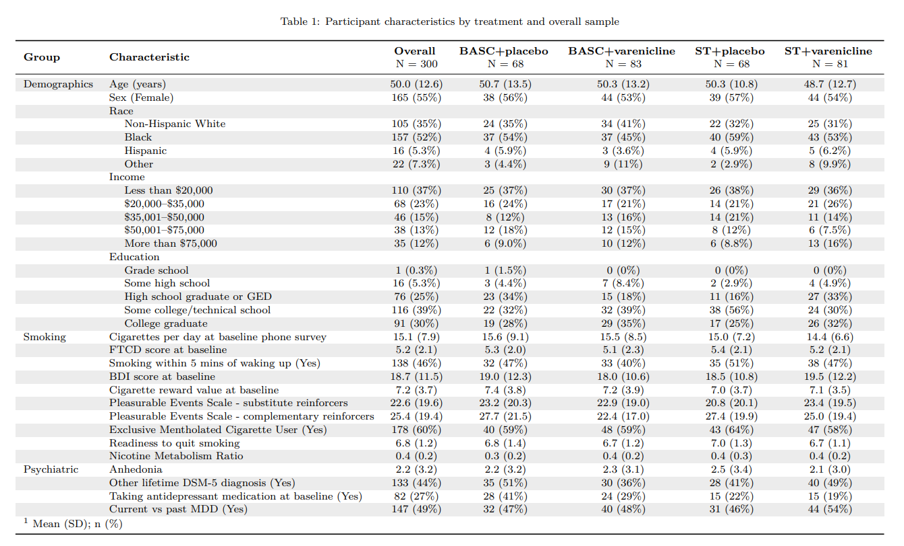
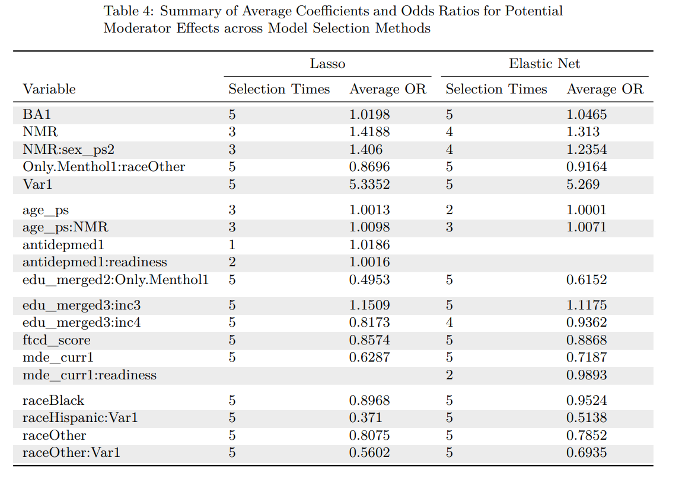
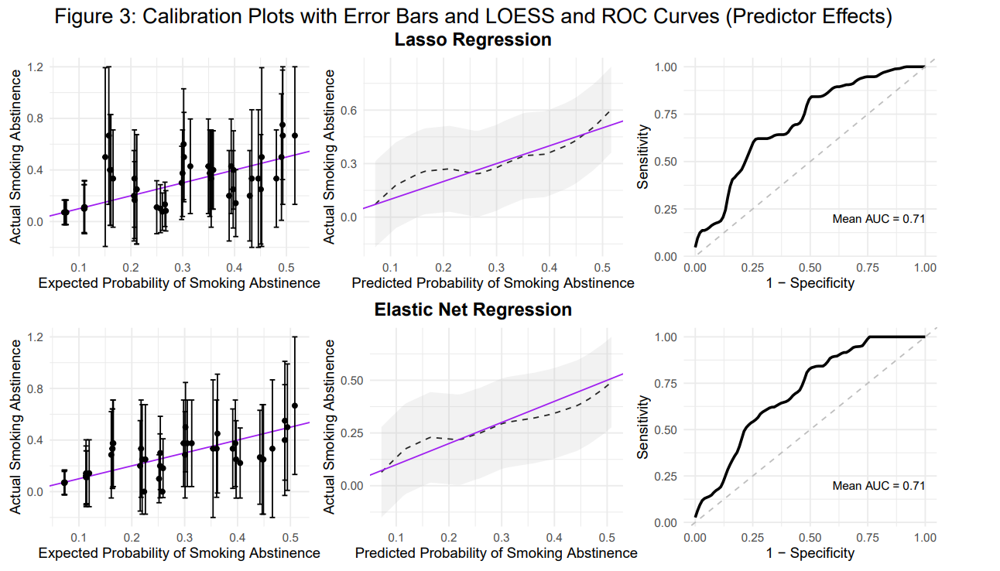
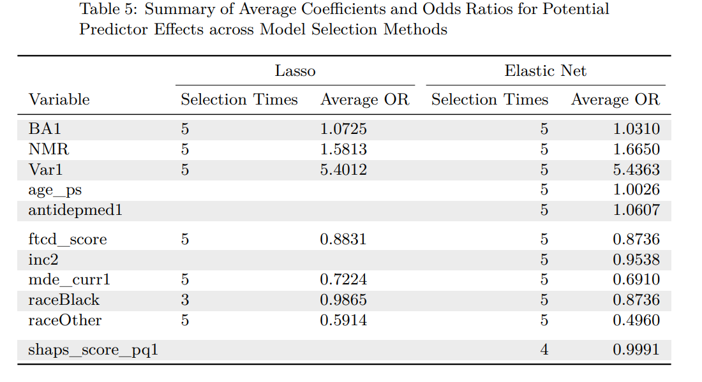

# Project-2

## Abstract

**Purpose**: This project evaluates the efficacy of smoking cessation treatments among adults with Major Depressive Disorder (MDD), focusing on identifying baseline factors that moderate and predict treatment success. This analysis aims to clarify the role of both behavioral and pharmacological interventions, examining interactions between participant characteristics and treatment components. 

**Methods**: Using data from a randomized, placebo-controlled trial, we assessed the effectiveness of Behavioral Activation (BA) and standard treatment (ST), each paired with either varenicline or a placebo, in supporting smoking cessation. Two statistical approaches-- Lasso regression and Elastic Net Regression with 10-fold cross validation-- were employed to identify significant moderators and predictors of abstinence at the end of treatment, based on a sample of 300 adult smokers with current or past MDD.

The findings indicate that specific baseline characteristics, including FTCD score (a measure of nicotine dependence) and Nicotine Metabolism Ratio (NMR), significantly influence treatment outcomes. FTCD score was associated with lower abstinence rates, while a higher NMR was linked to greater likelihood of cessation. These predictors were consistently identified across models, suggesting a robust relationship between these factors and smoking cessation outcomes.

**Conclusions**: This study supports the need for tailored smoking cessation strategies for individuals with MDD, highlighting the potential of combining behavioral and pharmacological treatments based on individual characteristics. By identifying critical predictors and moderators, the findings provide a foundation for developing more personalized and effective cessation programs for this high-risk population.

## File Description

**`project2_Rontogiannis_Rmarkdown.Rmd`**: The main Regression Analysis report

**`References.bib`**: The article bibliography for the report

**`Practical_Data_Analysis_Project2_Aristofanis_Rontogiannis.pdf`**: The knitted report as .pdf

## Dependancies

**Data Manipulation and Transformation**: `dplyr`, `reshape2`, `tidyr`, `lubridate`

**Data Visualization**: `ggplot2`, `patchwork`, `GGally`, `ggcorrplot`, `cowplot`, `ggmosaic`, `corrplot`, `ggbeeswarm`, `ggdist`, `grid`, `gridExtra`

**Data Summary and Reporting**: `gtsummary`, `summarytools`, `knitr`, `kableExtra`, `gtsummary`, `gt`

**Data Analysis and Evaluation**: `glmnet`, `leaps`, `pROC`, `MASS`

**Imputation and Missing Data Handling**: `MICE`

