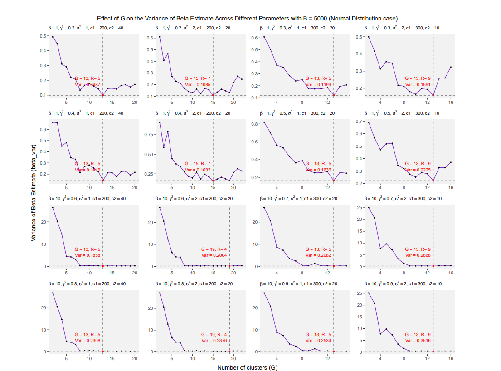
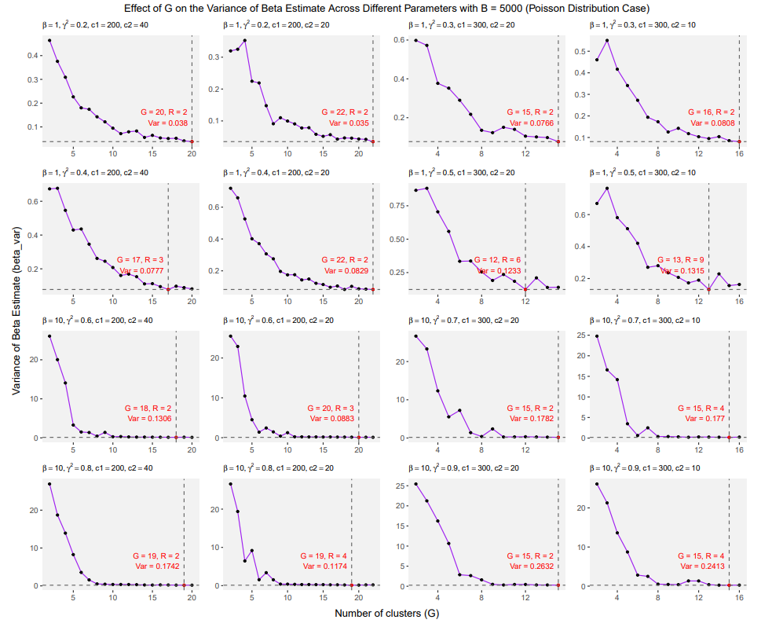
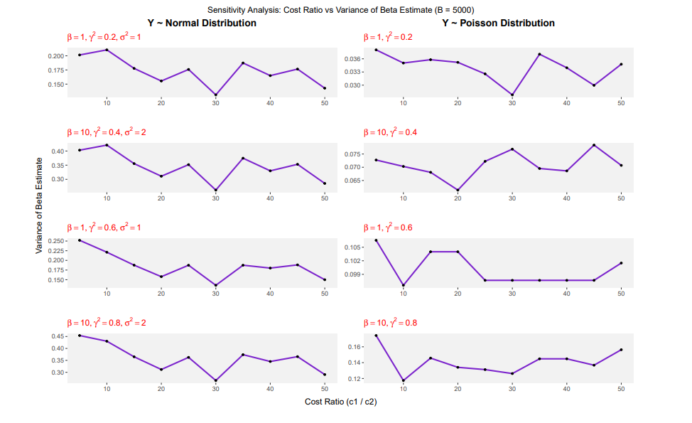
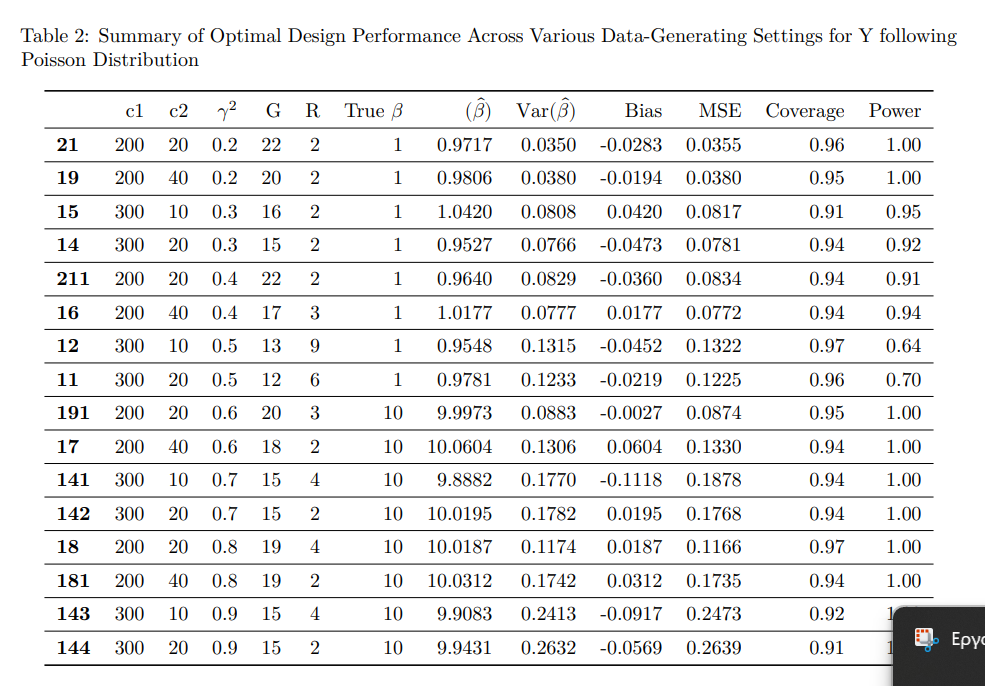

# Project-3

## Abstract

# Simulation Study on Cluster-Randomized Trials: Normal vs Poisson Models

## Purpose
The purpose of this study is to design and evaluate cluster-randomized trials under budget constraints using simulation methods. We aim to estimate the treatment effect ($\beta$) of an intervention on an outcome variable ($Y$) while optimizing study designs to minimize variance. Two hierarchical models for $Y$—Normal and Poisson—are considered, reflecting different data-generating mechanisms. We explore how design parameters, such as the number of clusters ($G$) and observations per cluster ($R$), as well as cost ratios ($c_1/c_2$), impact the precision of $\beta$ estimates.

## Methods
We conducted a simulation study using the ADEMP framework to evaluate experimental designs under two models: a Normal model for continuous outcomes and a Poisson model for count data. Both models incorporated fixed and random effects to account for treatment and cluster variability.

Using a fixed budget, combinations of clusters and observations per cluster were simulated across 50 iterations. Mixed-effects regression models were fitted to estimate the treatment effect, with performance assessed using variance, bias, mean squared error, coverage probability, and power. Sensitivity analyses explored the impact of varying costs and variance parameters on design performance, providing insights into optimal resource allocation and the differences between the two modeling frameworks.

## Results
In the Normal model, the variance of $\beta$ estimates decreased sharply with increasing $G$, though the benefit diminished at higher cluster counts, indicating diminishing returns. Variance was particularly sensitive to cost constraints, especially the fixed cost ($c_1$), and within-cluster variability ($\sigma^2$), where higher $\sigma^2$ led to increased overall variance. Additionally, oscillatory trends in variance across different cost ratios ($c_1/c_2$) suggested that resource allocation decisions have a more significant impact on design efficiency in this model. In contrast, the Poisson model exhibited higher variance for small $G$ and $R$, but variance stabilized more quickly with increasing $G$. Notably, the Poisson model showed robustness to changes in the cost ratio, with variance remaining largely unaffected across scenarios, indicating that cost trade-offs between clusters and observations play a smaller role for Poisson outcomes.

Optimal designs, defined as combinations of $G$ and $R$ that minimized variance, were identified for both models. For the Normal model, these designs favored a balance of moderate cluster numbers and reasonable within-cluster sample sizes, while the Poisson model often supported designs with fewer clusters but larger sample sizes per cluster. Sensitivity analysis revealed that increasing the cost ratio ($c_1/c_2$) shifted optimal designs toward fewer clusters with more observations per cluster, particularly in the Normal model. Coverage probabilities for 95% confidence intervals were close to nominal levels in both models, although they were slightly lower for the Poisson model in scenarios with small sample sizes or high cluster-level variability ($\gamma^2$). Power remained consistently high across most settings, emphasizing the robustness and reliability of the proposed designs in both frameworks. These results underscore the importance of tailoring experimental designs to the outcome distribution and cost structure for efficient and precise resource allocation.

## Conclusions
This simulation study demonstrates the utility of hierarchical models and the ADEMP framework in optimizing cluster-randomized trials under budget constraints. The findings highlight the trade-offs between the number of clusters and observations per cluster in achieving precise treatment effect estimates. Sensitivity analysis underscores the influence of cost structures on optimal designs. The Poisson model, while more appropriate for count data, requires careful consideration of sample size to ensure robust estimates. These insights provide valuable guidance for designing efficient and cost-effective cluster-randomized trials in practice.

## File Description

**`project3_Rontogiannis_Rmarkdown.Rmd`**: The code in R markdown

**`References.bib`**: The article bibliography for the report

**`project3_Rontogiannis_Rmarkdown.pdf`**: The knitted report as .pdf

## Dependancies

**Data Manipulation and Transformation**: `dplyr`, `reshape2`, `tidyr`, `lubridate`

**Data Visualization**: `ggplot2`, `patchwork`, `GGally`, `ggcorrplot`, `cowplot`, `ggmosaic`, `corrplot`, `ggbeeswarm`, `ggdist`, `grid`, `gridExtra`

**Data Summary and Reporting**: `gtsummary`, `summarytools`, `knitr`, `kableExtra`, `gtsummary`, `gt`

**Data Analysis and Evaluation**: `glmnet`, `leaps`, `pROC`, `MASS'

**Imputation and Missing Data Handling**: `MICE`

